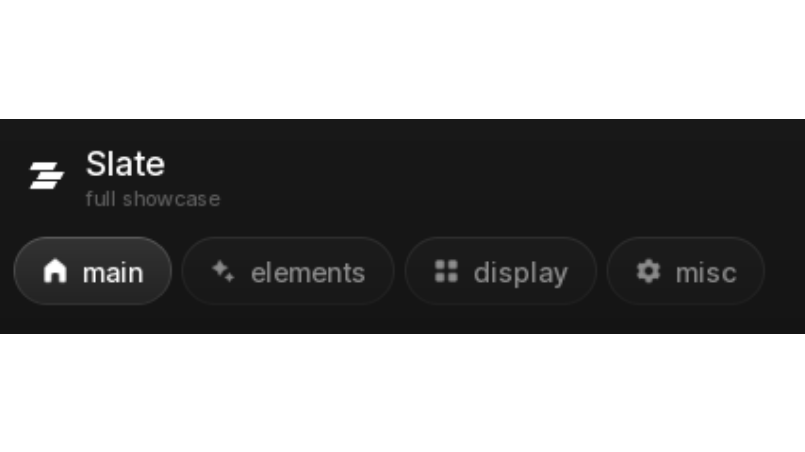

# Slate UI Documentation - Screenshots Guide

To make the Slate documentation site look 100% complete and polished, take these 4 screenshots in Roblox Studio / in-game and drop them into the `docs/assets/` directory (or replace the placeholders).

---

### 1. Main Window Overview
- **File Name**: `docs/assets/window-preview.png`
- **Recommended Size**: `1600 x 900` or `1920 x 1080` (16:9 ratio)
- **What to capture**:
  - Full Slate window centered on the screen.
  - The top navigation bar showing the Slate logo (`136661212895058`), window title ("Slate UI Library"), and active tabs ("General", "Combat", etc.) with their filled Fluent icons.
  - Left-hand side or main canvas with interactive toggles, sliders, and buttons.
- **Tip**: Use a dark, slightly blurred game background or a clean neutral studio skybox so the slate obsidian window stands out crisply.

---

### 2. Collapsed Minimalist Pill ("Tap to Show")
- **File Name**: `docs/assets/collapsed-preview.png`
- **Recommended Size**: `800 x 400`
- **What to capture**:
  - The compact floating pill state when the UI is minimized / closed.
  - Showing the Slate logo badge and the "Tap to show" text with smooth glow/border.

---

### 3. Component Showcase
- **File Name**: `docs/assets/components-preview.png`
- **Recommended Size**: `1400 x 800`
- **What to capture**:
  - A tab filled with various components:
    - Custom sliders with live percentage tooltips
    - Multi-select dropdown menus open
    - Input textboxes with placeholder text
    - Keybind selector chips
    - Interactive action buttons

---

### 4. Interactive Color Picker Modal
- **File Name**: `docs/assets/colorpicker-preview.png`
- **Recommended Size**: `1000 x 700`
- **What to capture**:
  - The Slate RGB/HSV color picker modal opened.
  - Showing the 2D gradient canvas, hue slider bar, hex input field, and live color preview swatch.

---

### How to Link into `docs/index.html`:
In `docs/index.html`, replace the image placeholders with:
```html

```
